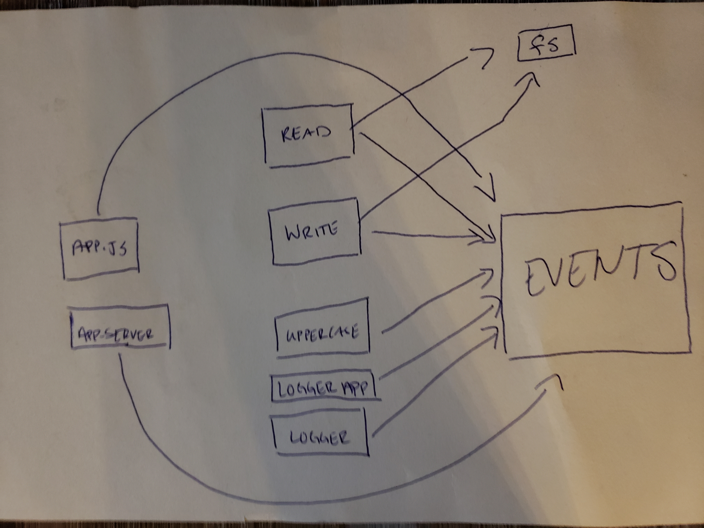

# LAB - Class 17

### Author: Ibrahim

### Links and Resources

- [submission PR](https://github.com/401-advanced-javascript-ibrahim/lab17/pull/1)
- [ci/cd](https://github.com/401-advanced-javascript-ibrahim/lab17/actions/runs/45718273) (GitHub Actions)

### Setup
npm i jest eslint

#### How to initialize/run your application (where applicable)

- `npm test`

#### Tests

- How do you run tests?
     - 'npm test'

#### UML
Link to an image of the UML for your application and response to events

